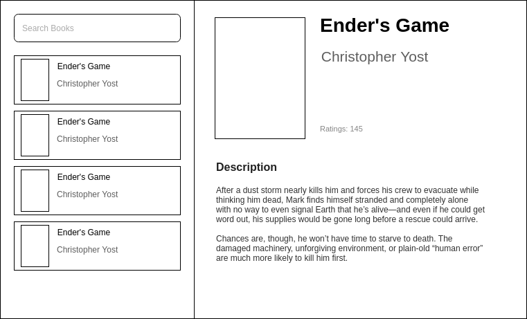

### INTRODUCTION
A React app which can be used to see the detailed information about books from GoodReads.com.

### REMOVED CORS-ANYWHERE.COM
The app now uses its own Express API to mitigate CORS related issues. It is not dependent on any third party endpoint anymore.

### MOCKUP
I created the following wireframe to decide on the key features of the prospective product.


### SETUP
1. The project is based on [Next.js](https://nextjs.org/).
2. The project follows `styled-css` methodology for styling, due to Next.js.
3. All the major React components can be found under `components` folder.
4. For state management, the project uses `Redux`. 
5. All state management and data fetching logic can be found under `redux` folder.
6. The UI is built using CSS3 Flexbox.
7. The project uses Eslint for checking common linting errors.
8. The production site is hosted on Heroku. [Check it out](https://goodread-challenge.herokuapp.com/).

### RUNNING AND DEBUGGING
1. To start the development server locally
```
npm run dev
```

2. To run tests
```
npm run test
```

3. To run the linter
```
npm run lint
```

4. To fix common linting errors
```
npm run lint -- --fix
```

### FUTURE IMPROVEMENTS
- Development Side:
  - Use something like `Flow` or `React.propTypes` for strict typing.
  - Constants like developer keys etc., can be stored and loaded with libraries like `dot-env`.
  - Ensure consistent `BEM` based naming convention for CSS classes.

- UI/UX Side:
  - As of now, an in-transition search cannot be cancelled, would like to make it cancellable.
  - Under the `Description` section, the app renders CDATA, instead of plain text. It could be handled appropriately.
  - To make it more responsive for smaller screens.
  - The Book list can be made to scroll, so as to fit the overflowing UI into the viewport.